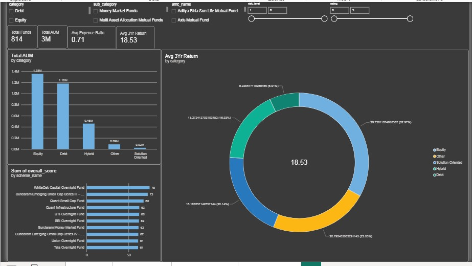

# Mutual Fund Overview & Insights

An end-to-end data analytics project that scores and ranks 814 Indian mutual fund schemes on a transparent return/risk/cost formula, shortlists the Top 30, and presents the findings through an interactive dashboard for a non-technical, first-time investor.

**Pipeline:** Python (Pandas, scikit-learn) → Excel workbook → Interactive dashboard (Power BI + HTML)



## Goal

Identify mutual fund schemes with a strong return/risk/cost balance and communicate the findings in a way a first-time investor can act on — without simply chasing the highest return.

## Scoring Formula

```text
Score = 100 x [ 0.35 x 3Yr Return (normalized)
              + 0.25 x Low Risk (normalized, inverted)
              + 0.20 x Low Expense (normalized, inverted)
              + 0.10 x Moderate Age (normalized)
              + 0.10 x Positive 1Yr Return (flag: 1 if >0, else 0) ]
```

## Key Insights

- Largest AUM category: Equity — ₹13,54,231.74 crore, 43.6% of total dataset AUM.
- Highest-AUM fund manager: Rahul Goswami — ₹1,31,306 crore across 8 schemes.
- Lowest expense ratio: Debt category overall (0.36% average).
- Best 1-year return: Bank of India Credit Risk Fund at 130.8%, flagged as an outlier.
- Average minimum SIP: ₹528.50; median minimum lump-sum: ₹5,000.
- Top 30 category mix: Debt 21, Hybrid 5, Equity 4.

## Repo Contents

- `mutual_fund_analysis.py` — full analysis pipeline
- `Mutual_Fund_Analysis.xlsx` — Excel analysis workbook
- `Mutual_fund_dashboard.pbix` — Power BI dashboard
- `mutual_fund_dashboard.html` — standalone interactive HTML dashboard
- `Project_Writeup.md` — detailed project write-up
- `screenshots/` — dashboard screenshots

## Tools Used

Python, Pandas, scikit-learn, Excel, Power BI, HTML.
