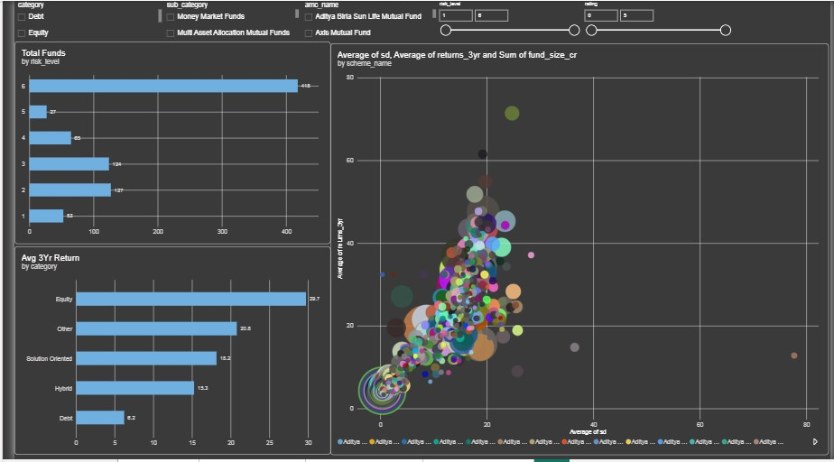
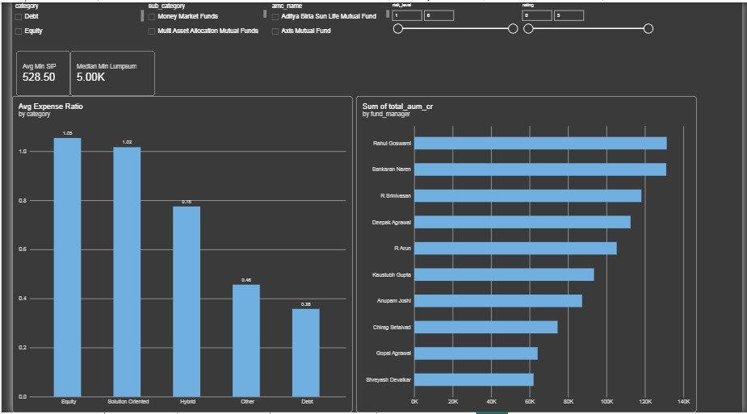
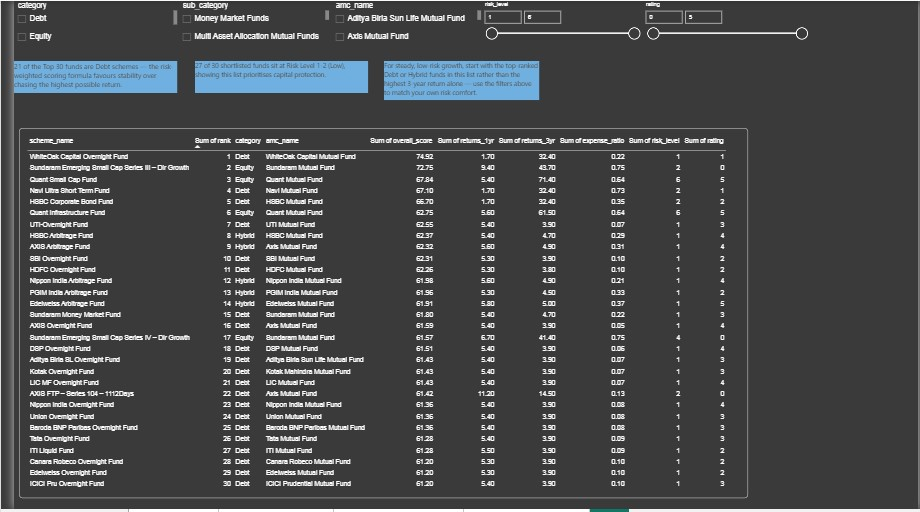

# Mutual Fund Overview & Insights

An end-to-end data analytics project that scores and ranks 814 Indian mutual fund schemes on a transparent return/risk/cost formula, shortlists the Top 30, and presents the findings through an interactive dashboard for a non-technical, first-time investor.

**Pipeline:** Python (Pandas, scikit-learn) → Excel workbook → Interactive dashboard (Power BI + HTML)


---

## Goal

Identify mutual fund schemes with a strong return/risk/cost balance and communicate the findings in a way a first-time investor can act on — without simply chasing the highest return.

**Why balance return and risk?** A very high-return fund can also carry high risk or high cost. Ranking by return alone favors volatile or expensive funds — for example, the single highest 1-year return in this dataset (130.8%) comes from a *Debt*-category fund, a category that normally averages ~6% over three years. That's almost certainly a one-off NAV recovery, not repeatable skill — exactly the kind of pick a return-only ranking would wrongly reward.

**Workflow:** clean the data → explore patterns → normalize metrics → build a transparent weighted score → rank funds → export the Top 30 → build an interactive dashboard.

---

## Dataset

`comprehensive_mutual_funds_data.csv` — 814 mutual fund schemes × 20 columns.

*(Note: the original brief describes 2,500+ schemes; the supplied file contains 814 — this analysis uses the supplied file as-is.)*

---

## Stage 1 — Data Cleaning

- `sortino`, `alpha`, `sd`, `beta`, and `sharpe` loaded as text because missing values used the placeholder `"-"` instead of a blank cell. Fixed by replacing `"-"` with `NaN` and casting to float.
- Missing values:

| Field | Missing | % |
|---|---|---|
| `returns_3yr` | 21 | 2.58% |
| `returns_5yr` | 167 | 20.52% |
| `sortino`, `sharpe` | 23 each | 2.83% |
| `alpha`, `beta` | 42 each | 5.16% |

Rows missing `returns_3yr` (a required scoring input) are **excluded from ranking** rather than imputed. `returns_5yr` isn't a scoring input and is left as genuine missing data (many funds are simply too young for a 5-year history).

## Stage 2 — Data Description

Descriptive statistics (mean, median, mode, min, max, std dev, skewness) computed for all 10 numeric fields (`statistics.csv`). Median expense ratio is 0.615%, median fund age is 10 years, and `returns_1yr` is heavily right-skewed (skewness ≈ 8.4), driven almost entirely by the Bank of India Credit Risk Fund outlier at 130.8%.

## Stage 3 — Normalization

`MinMaxScaler` applied to `returns_3yr`, `risk_level`, and `expense_ratio`. Since lower `risk_level` and `expense_ratio` are better, those two scores are **inverted** (`1 − scaled_value`) so every term in the final formula means "higher = better." `fund_age_yr` is scored for **closeness to a 7.5-year sweet spot** instead of being maximized, since both brand-new and unusually old funds are less desirable than a fund with a proven, moderate history.

## Stage 4 — Fund Scoring & Ranking

```
Score = 100 x [ 0.35 x 3Yr Return (normalized)
              + 0.25 x Low Risk (normalized, inverted)
              + 0.20 x Low Expense (normalized, inverted)
              + 0.10 x Moderate Age (normalized)
              + 0.10 x Positive 1Yr Return (flag: 1 if >0, else 0) ]
```

Return carries the largest weight because it's the primary reason to invest; risk is weighted second-highest because the brief's core premise is that risk must be actively controlled; expense ratio is a smaller but still meaningful recurring cost; age and 1-year consistency act as secondary sense-checks. All 793 funds with a valid 3-year return were scored and ranked.



## Stage 5 — Top 30 Shortlist

- **Category mix:** Debt 21, Hybrid 5, Equity 4.
- **Risk profile:** 27 of the 30 shortlisted funds sit at risk level 1–2 (Low / Low-Moderate) — the 25% weight on low risk visibly pulls the shortlist toward stable, lower-volatility schemes rather than pure high-return chasers.
- **Rank #1:** the top-scoring fund combines a strong 3-year return with very low risk level and a low expense ratio — all four factors pulling in the same direction.





## Key Insights

1. **Largest AUM category:** Equity — ₹13,54,231.74 crore, 43.6% of total dataset AUM.
2. **Highest-AUM fund manager:** Rahul Goswami — ₹1,31,306 crore across 8 schemes.
3. **Lowest expense ratio:** Debt category overall (0.36% average); Fixed Maturity Plans is the cheapest sub-category (0.045% average).
4. **Best 1-year return:** Bank of India Credit Risk Fund at 130.8% — flagged as an outlier and specifically why 1-year return is used only as a consistency *flag* in the scoring formula, not the primary driver.
5. **SIP / lump-sum:** average minimum SIP ₹528.50; median minimum lump-sum ₹5,000 (average ₹3,047.47).
6. **3-year return by category:** Equity 29.7% → Other 20.8% → Solution Oriented 18.2% → Hybrid 15.3% → Debt 6.2%. Return climbs with category risk level almost monotonically.

**Final reflection.** For a first-time investor wanting low-risk, steady growth, the Top 30 shortlist already leans toward Debt and Hybrid schemes rather than the highest-return Equity funds — a direct result of weighting risk at 25% in the formula. Python made the process reproducible and auditable, Excel made the result portable, and the dashboard turns the numbers into something explorable rather than a static list.

---

## Repo Contents

| File | Description |
|---|---|
| `mutual_fund_analysis.py` | Full pipeline: cleaning → description → normalization → scoring/ranking → Top 30 export → summary tables |
| `Mutual_Fund_Analysis.xlsx` | Excel workbook packaging the cleaned data, statistics, summaries, and Top 30 shortlist |
| `Mutual_fund_dashboard.pbix` | Power BI dashboard file (open in Power BI Desktop) |
| `mutual_fund_dashboard.html` | Standalone interactive HTML version of the dashboard |
| `Project_Writeup.md` | Full stage-by-stage write-up this README is adapted from |
| `screenshots/` | Dashboard screenshots |

## Tools Used

- **Python** — Pandas, scikit-learn (`MinMaxScaler`)
- **Excel** — data packaging and shareable summary sheets
- **Power BI / HTML** — interactive dashboard with category, sub-category, AMC, risk-level, and rating filters
